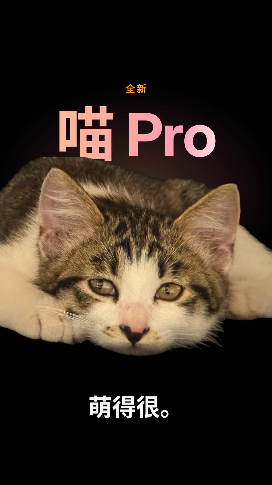

# 喵 Pro · 发布会

一支 50 秒、竖屏（1080×1920 · 60fps）的“苹果发布会”风格宣传片，主角是一只狸花白小奶猫。

**成片：[`out/meow-pro.mp4`](out/meow-pro.mp4)** · 封面：[`out/cover.jpg`](out/cover.jpg)



## 分镜

| 时间 | 段落 | 画面 | 文案 |
| --- | --- | --- | --- |
| 0–4s | 预告 | 四个微距细节装在一个会变形的窗口里（圆 → 胶囊 → 圆角矩形 → 方圆），最后收成一个光点 | 凝视 · 纹理 · 触感 · 心动 |
| 4–8s | hello | 光点化作笔尖，手写单线 “hello”，镜头从字母 o 里穿过去 | — |
| 8–12s | 揭幕 | 标题从小猫身后升起（锁屏景深效果），配乐 drop | 全新 · 喵 Pro · 萌得很。 |
| 12–16s | 配色 | 取色放大镜依次吸取眼睛、鼻头、背毛、尾尖 | 四种配色，一身集齐。琥珀金 · 肉垫粉 · 狸花棕 · 奶油白 · 全球限量，仅此一只。 |
| 16–20s | M 芯片 | 金线描出额头的虎斑 “M”，缩成一颗芯片，电路走线点亮 | M 系列芯片，额头自带。 |
| 20–24s | 双眸 / 夜间模式 | 对焦框锁定双眼；灯光熄灭，只剩眼睛发光 | 一眼，就沦陷。夜间模式，天生自带。 |
| 24–30s | 传感器 / Nose ID | 扫描线显出小猫；耳朵声波、胡须 LiDAR 点阵扫描；Face ID 刻度环填满，打勾 | 空间音频 · 胡须 LiDAR · Nose ID |
| 30–33s | MagSafe | Face ID 的圆环变成 MagSafe 磁吸环，吸在趴在键盘上的小猫身上 | MagSafe 磁吸设计，一靠近键盘，就自动吸附。 |
| 33–36s | 续航 | 灵动岛弹出“睡眠模式”，电量随数字涨到 20 | 超长续航，主要靠睡。最长可达 20 小时 |
| 36–40s | 亮点总览 | 画面收进一格，展开成 bento 卡片墙 | — |
| 40–44s | One more thing | 小猫在长，成长进度条走到 37%，然后巨大的脸 | 它，还在长大。喵 Pro Max · 长大后见。 |
| 44–50s | 收尾 | 聚光灯下的产品照、价格，最后是 logo | 售价：非卖品，仅供宠爱。Designed by Nature. |

片中的“参数”都来自真实的猫咪习性（每只耳朵 32 块肌肉、24 根胡须、暗光下只需约 1/6 的光线、小奶猫每天最多睡约 20 小时、鼻纹独一无二、虎斑额头的 “M”），外加一点夸张。

## 怎么做的

整支片子是一个网页：`web/keynote.js` 里每个元素的位置都是时间的函数，`window.seek(t)` 可以跳到任意一帧。无头 Chromium 逐帧截图，ffmpeg 合成视频。

- **素材**（`tools/prepare_assets.py`）：Display P3 → sRGB 转换、调色；BiRefNet 抠图（`tools/segment.py`，mask 已提交在 `src/masks/`）；Real-ESRGAN 4× 超分用于微距镜头（`tools/esrgan_onnx.py` 不依赖 PyTorch，把权重直接转成 ONNX）。
- **配乐**（`tools/compose.py`）：全部用 numpy 合成，120 BPM、F 大调，律动段用 IV–V–iii–vi（B♭maj7 – C – Am7 – Dm7），片尾在 logo 出现时落回主和弦 Fmaj9。每一个转场、弹出、对焦、磁吸、打勾的音效都对在画面的时间点上。响度 −15 LUFS，true peak −1 dBTP，并为手机扬声器做了低频收敛。
- **字体**：Noto Sans SC、Inter（SIL OFL 1.1），已按片中用到的字做了子集。

## 重新生成

```bash
pip install -r requirements.txt     # numpy scipy pillow pyloudnorm（素材步骤另需 onnxruntime / onnx / rembg）
npm install                          # playwright；如已全局安装可跳过
./build.sh                           # 60fps 成片 → out/meow-pro.mp4（需 ffmpeg；可用 FFMPEG=/path/to/ffmpeg 指定）
PREVIEW=1 ./build.sh                 # 30fps 快速预览
node tools/shot.cjs shots 8.5,22.8   # 截取任意时间点
```

想改猫的名字或文案，直接改 `web/keynote.js` 里的文字即可；如果出现了新的汉字，需要重新对 `web/fonts/NotoSansSC-VF.ttf` 做子集（或换成完整字体）。重建素材（`SKIP_ASSETS=0 ./build.sh`）需要先下载 Real-ESRGAN 权重并用 `tools/esrgan_onnx.py` 转换，`MODELS_DIR` 指向输出目录。

## 致谢

照片由猫主人拍摄。Real-ESRGAN（BSD-3-Clause）、BiRefNet / rembg（MIT）、Noto Sans SC 与 Inter（OFL-1.1）。片中的 Retina、MagSafe、Face ID、灵动岛等说法仅作致敬与玩笑，与 Apple 无关。
